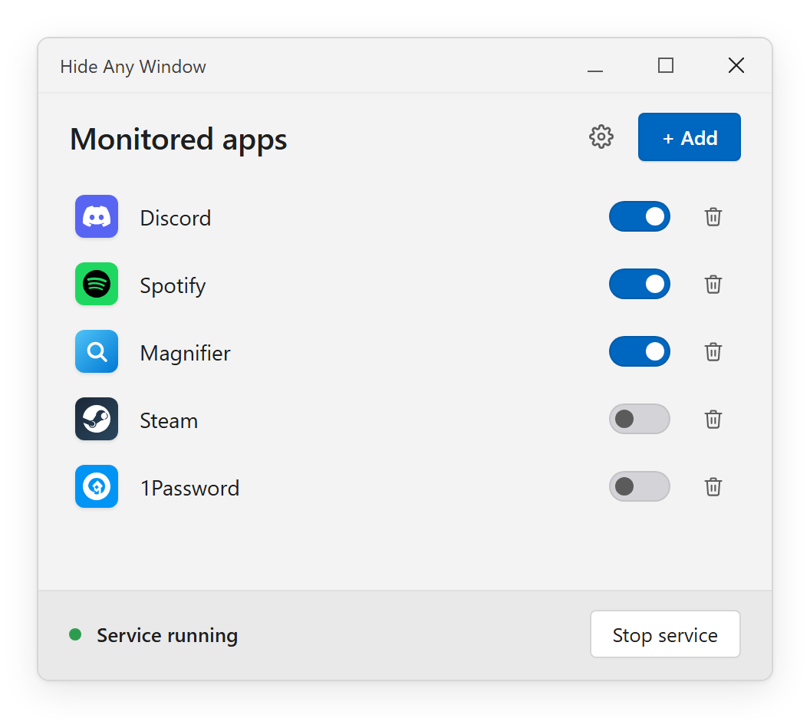
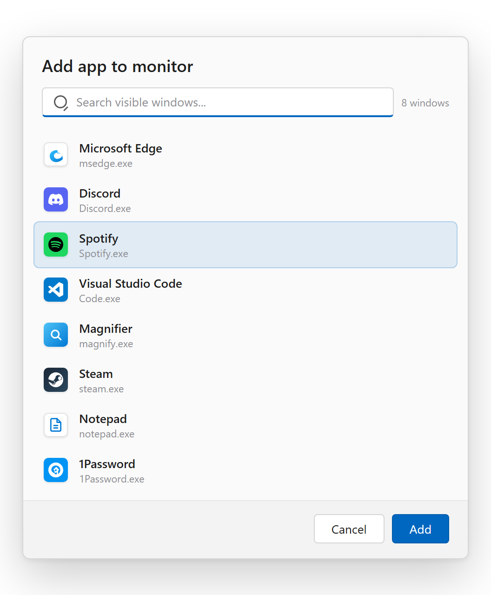

<div align="center">
  

  # Hide Any Window

  Auto-hide any Windows app, even Magnifier. No taskbar icon. No Alt-Tab entry. No fuss.

  [](https://github.com/Maxaubert/Hide-Any-Window/releases/latest)
  [](https://github.com/Maxaubert/Hide-Any-Window/releases/latest)
</div>

---

## What it does

Pick an app. Toggle "hide" on. From then on, every time a window of that app appears it vanishes the moment it shows: gone from the screen, gone from the taskbar, gone from Alt-Tab. Toggle off and the window comes back.

Works on apps that resist normal "minimize to tray" tools, including Windows Magnifier.

## Install

1. Download `HideAnyWindow-Setup.exe` from the [latest release](https://github.com/Maxaubert/Hide-Any-Window/releases/latest).
2. Double-click. Approve the UAC prompt.
3. Done.

No .NET install, no AutoHotkey install, no other downloads. Everything is bundled.

> SmartScreen may show a warning the first time. Click **More info**, then **Run anyway**. The installer is signed with a self-signed certificate and Windows has no reputation history yet, so it errs on the side of caution.

## Use

<div align="center">
  
</div>

1. Open **Hide Any Window** from the Start menu.
2. Click **Start service** in the footer.
3. Click **+ Add**, pick the app you want to hide, click **Add**.
4. Toggle the row on.

Open the app and it disappears. Toggle off when you want it back.

The picker lists every app with a visible window:

<div align="center">
  
</div>

## Settings

The gear icon in the toolbar opens **Settings**. One option for now:

- **Start at logon**: when on, the service auto-launches when you sign in to Windows. Off by default.

## Uninstall

Settings > Apps > Hide Any Window > Uninstall. Removes the manager, the service, the trusted certificate, and the optional logon task.

## Build from source

For developers.

Requirements:

- Windows 10 or 11
- [.NET 8 SDK](https://dotnet.microsoft.com/download/dotnet/8.0)
- [AutoHotkey v2](https://www.autohotkey.com/) (only needed to build the service exe)
- [Inno Setup 6](https://jrsoftware.org/isdl.php) (only needed to build the installer)

```powershell
git clone https://github.com/Maxaubert/Hide-Any-Window.git
cd Hide-Any-Window
dotnet build manager\HideAnyWindowManager.sln
```

To produce the installer:

```powershell
powershell -ExecutionPolicy Bypass -File dist\build.ps1
```

Output: `dist\HideAnyWindow-Setup.exe`.

## How it works

Two pieces, one shared config file.

- **Service** (`service/`): a compiled AutoHotkey v2 script with a UIAccess manifest. Watches for windows of configured apps via `SetWinEventHook`, hides matches with `WinHide` plus `ITaskbarList::DeleteTab`. Holds a named mutex so the manager can detect liveness.
- **Manager** (`manager/`): a WinUI 3 / .NET 8 desktop app. Reads and writes `%APPDATA%\HideAnyWindow\config.json`. Talks to the service through that file plus the named mutex.

Design notes and implementation plans live in `docs/superpowers/`.

## License

MIT (see [LICENSE](LICENSE) once added).
